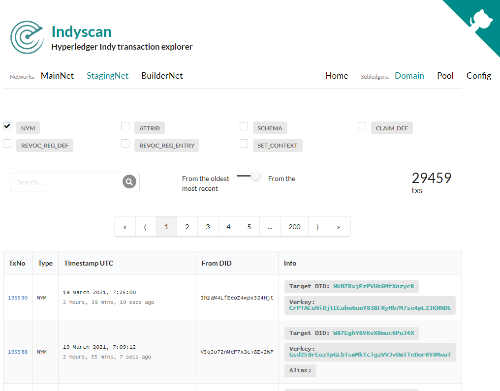
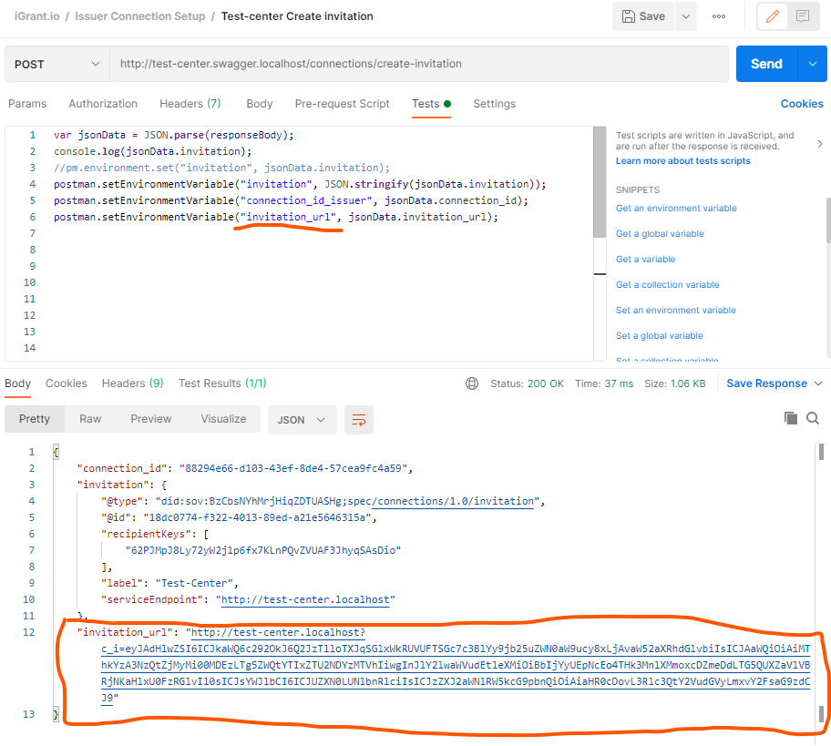
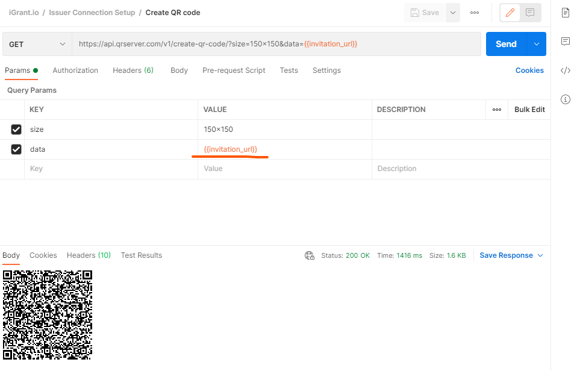

## Tools and Best Practices

These are some tips when developing interop tests. Some are tied to certains tools like postman and some are general.

### General

#### Sovrin staging 

A very useful tool to check Sovrin Staging is the [Indyscan](https://indyscan.io/txs/SOVRIN_STAGINGNET/domain). You can check registered DID by selecting "NYM", check registered schemas by selecting "SCHEMA" and check credential definitions by selecting "CLAIM_DEF". In some circumstances when registering a new schema IF the schema version is the same as the old one you will not be able to register using the same version number. Important to bump up the version number.

### Postman

Usage of postman is not an endorsement of the tool but if using the tool here are some useful hints. Assumption is that you are familiar with the tool and are able to create variables.

#### Creating QR code

When trying to create the invitation_url QR code there is a convenient API that you can use to generate the QR code and be able to scan directly from postman in the process. First you read and store the invitation_url into a variable.

Next you run a request to following url to get a QR code back.

https://api.qrserver.com/v1/create-qr-code/?size=150x150&data={{invitation_url}}

